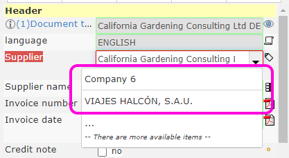

# Enterprise / Administration / Configuration variables

> ## System parameters (wci_params)

* #### **Logfile**
    * _Log files are located under folder C:\chronoscanlog\_  
    * [ ] Logfile OFF
    * [X] Logfile ON
    > **Note:** Having the log file enabled may affect the application performance
* #### **md5salt**
    * _Type_: String
    * _Description_: Encrypt hash
    * _Default_: Auto-generated md5 hash
* #### **wci_batches_panel_allow_operators_delete_batches**
    * _Type_: Boolean
    * _Description_: [Allow|Do not allow] [operator|indexer|editor] users to delete batches on the 'Batches' tab section of the application
    * _Default_: false
* #### **wci_dashboard_allow_filtering_by_imap_fields**
    * _Type_: Boolean
    * _Description_: [Allow|Do not allow] Filtering the dashboard batches lists by [IMAP Senders|IMAP Recipients] 
    * _Default_: false
    * _Image_   
* #### **wci_dashboard_autorefresh_seconds**
    * _Type_: Number
    * _Description_: It determines the time (**in seconds**) that the dashboard information takes to auto-refresh
    * _Default_: 5
* #### **wci_dashboard_hide_export_error_batches_for_nonadmin**
    * _Type_: Boolean
    * _Description_: If set to _true_, non admin users won't see batches with errors under the ready to export dashboard inbox list
    * _Default_: false
* #### **wci_dashboard_max_items**
    * _Type_: Number
    * _Description_: It determines the number of records per page to show in the dashboard inboxes lists
    * _Default_: 100
    * _Image_: _*In this example the variable has been set to 5_   
* #### **wci_diagnosis_input_server_url**
    * _Type_: String
    * _Description_: Url for opening the diagnosis and information web application for the _Input server_
    * _Default_: http://localhost:9007/
* #### **wci_diagnosis_output_server_url**
    * _Type_: String
    * _Description_: Url for opening the diagnosis and information web application for the _Output server_
    * _Default_: http://localhost:9009/
* #### **wci_diagnosis_proc_server_url**
    * _Type_: String
    * _Description_: Url for opening the diagnosis and information web application for the _Processing server_
    * _Default_: http://localhost:9008/
* #### **wci_indexview_max_session_timeout_seconds**
    * _Type_: Number
    * _Description_: If the index view remains without user activity for longer than this time (**in seconds**), current batch will be saved and current session will be closed.
    * _Default_: 360
* #### **wci_input_root**
    * _Type_: String
    * _Description_: Root directory for hotfolder configurations
    * _Default_: C:\WCI_INPUT_ROOT
* #### **wci_instance_title**
    * _Type_: String
    * _Description_: Name to show on Enterprise title
    * _Default_: Your configuration name
* #### **wci_license_number**
    * _Type_: String
    * _Description_: License number information
    * _Default_: 
* #### **wci_lists_max_page_values**
    * _Type_: Number
    * _Description_: Number of items to appear on fields with lists on [Search|Characters introduction]
    * _Default_: 15
    * _Image_: _*In this example the variable has been set to 2_   
* #### **wci_mainurl**
    * _Type_: String
    * _Description_: Url for enterprise web application
    * _Default_: http://localhost:10000
* #### **wci_max_log_days**
    * _Type_: int
    * _Description_: If greater than 0, the table containing logs will only keep records that are greater than today minus *value* days
    * _Example_: If you just want to keep log records for the last 7 days, set this value to 7
    * _Default_: -1 (Disabled)
* #### **wci_max_smtp_notifications_days**
    * _Type_: int
    * _Description_: If greater than 0, the table containing smtp notifications will only keep records that are greater than today minus *value* days
    * _Example_: If you just want to keep smtp notification records for the last 7 days, set this value to 7
    * _Default_: -1 (Disabled)
* #### **wci_max_system_notifications_days**
    * _Type_: int
    * _Description_: If greater than 0, the table containing system notifications will only keep records that are greater than today minus *value* days
    * _Example_: If you just want to keep system notification records for the last 7, set this value to 7
    * _Default_: -1 (Disabled)
* #### **wci_scan_plugin_directory**
    * _Type_: String
    * _Description_: <a href="https://www.chronoscan.org/wcidoc/running_chronoscan_web_server_through_a_reverse_proxy__helicon_ape__print.htm" target="_blank">See docs</a>
    * _Default_: &lt;&lt;default&gt;&gt;
* #### **wci_scan_plugin_host**
    * _Type_: String
    * _Description_: <a href="https://www.chronoscan.org/wcidoc/running_chronoscan_web_server_through_a_reverse_proxy__helicon_ape__print.htm" target="_blank">See docs</a>
    * _Default_: &lt;&lt;default&gt;&gt;
* #### **wci_spacedisk_warning_megabytes**

* #### **wci_system_alert_IMAP_cnxfail**
* #### **wci_system_alert_IMAP_cnxfail_Recipients**
* #### **wci_system_alerts_email**
* #### **wci_system_database_version**
* #### **wci_ui_header_ref**
* #### **wci_ui_header_title**
* #### **wci_ui_login_welcome_logo**
* #### **wci_ui_main_title**

> ## Global parameters

* #### **Amounts_correction**
* #### **OnBatchCreated_Recipients**
* #### **OnBatchCreated_RecipientsActive**
* #### **OnBatchDeleted_Recipients**
* #### **OnBatchDeleted_RecipientsActive**
* #### **OnBatchExportedWithErrors_Recipients**
* #### **OnBatchExportedWithErrors_RecipientsActive**
* #### **OnBatchExported_Recipients**
* #### **OnBatchExported_RecipientsActive**
* #### **OnBatchOpen_Recipients**
* #### **OnBatchOpen_RecipientsActive**
* #### **OnBatchProcessed_Recipients**
* #### **OnBatchProcessed_RecipientsActive**
* #### **OnBatch_New_documents_to_approve**
* #### **OnBatch_New_documents_to_approveActive**
* #### **OnBatch_New_documents_to_configure**
* #### **OnBatch_New_documents_to_configureActive**
* #### **OnBatch_New_documents_to_index**
* #### **OnBatch_New_documents_to_indexActive**
* #### **OnBatch_New_documents_to_postclass**
* #### **OnBatch_New_documents_to_postclassActive**
* #### **OnBatch_New_documents_to_preclass**
* #### **OnBatch_New_documents_to_preclassActive**
* #### **OnBatch_ProcessingTime_LongerThan**
* #### **OnBatch_ProcessingTime_LongerThanActive**
* #### **OnBatch_ProcessingTime_LongerThanConditionalMinutes**
* #### **OnBatch_Status_[created]_WaitingFor**
* #### **OnBatch_Status_[created]_WaitingForActive**
* #### **OnBatch_Status_[pre_class]_WaitingFor**
* #### **OnBatch_Status_[pre_class]_WaitingForActive**
* #### **OnBatch_Status_[ready_to_export]_WaitingFor**
* #### **OnBatch_Status_[ready_to_export]_WaitingForActive**
* #### **OnCommented_DocumentType_Recipients**
* #### **OnCommented_DocumentType_RecipientsActive**
* #### **OnCommented_Document_Recipients**
* #### **OnCommented_Document_RecipientsActive**
* #### **OnDocumentImportError**
* #### **OnDocumentImportErrorActive**
* #### **OnDocumentType_Configured_Recipients**
* #### **OnDocumentType_Configured_RecipientsActive**
* #### **OnDocumentType_NewType_Recipients**
* #### **OnDocumentType_NewType_RecipientsActive**
* #### **OnDocumentType_ToReview_Recipients**
* #### **OnDocumentType_ToReview_RecipientsActive**
* #### **OnJob_Num_batches_to_index**
* #### **capture_date_search_year_max**
* #### **capture_date_search_year_min**
* #### **capture_dateformat**
* #### **capture_decimalseparator**
* #### **capture_numberformat**
* #### **capture_dateformat**
* #### **datatype_amount_default_decimals**
* #### **document_type_disable_offsets_by_default**
* #### **force_manual_index**
* #### **job_admin_email**
* #### **job_default_ocr**

